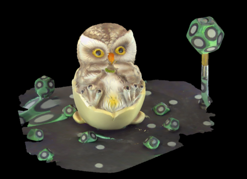
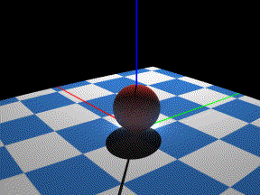
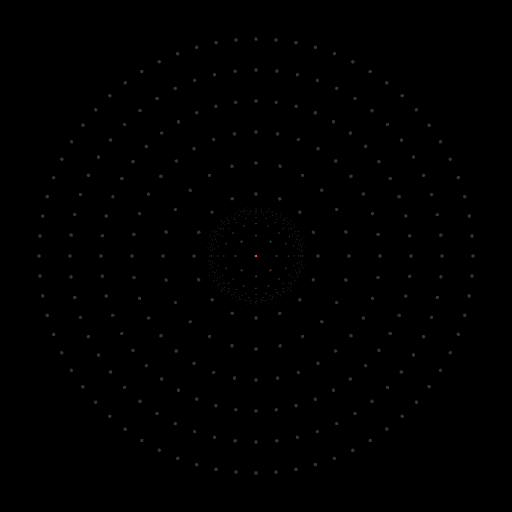
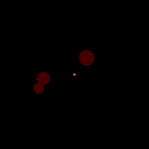
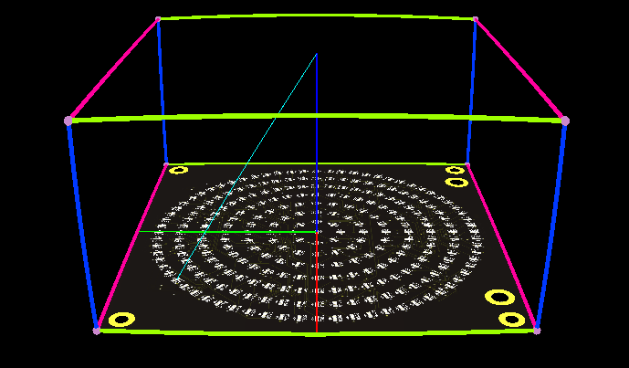
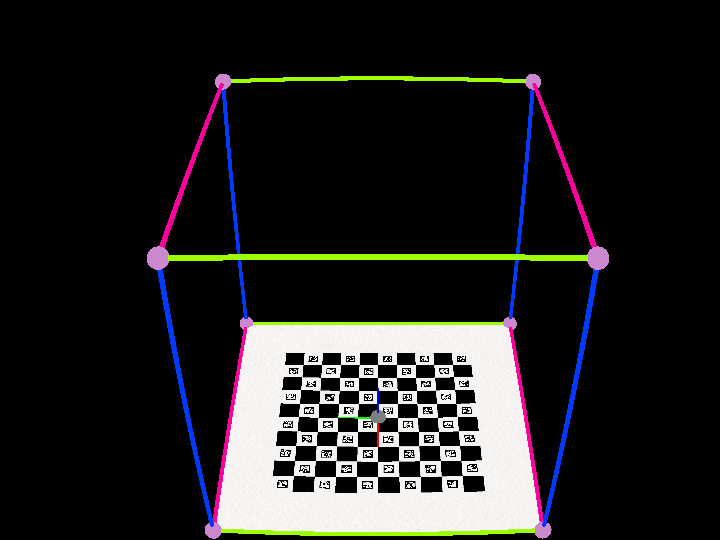
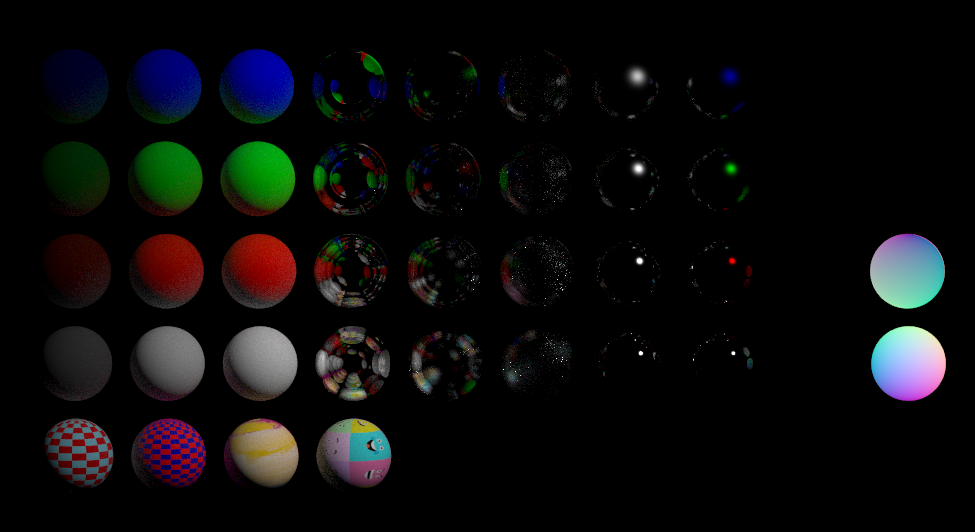

# raytrace — physically based renderer in Go (standard library only)

Raytrace can simulate a way range of practical optical systems for robotics, machine vision, and scientific imaging.

I wrote this renderer to learn graphics the hard way:
by building a physically based path tracer in pure Go,
with no dependencies beyond the standard library.

If you are curious about rendering, want a readable codebase,
and like to tinker, this project is for you.

Many of the concepts and algorithms are inspired by the excellent
books and projects listed below:

* [Ray Tracing in One Weekend](https://raytracing.github.io/books/RayTracingInOneWeekend.html)
  by Peter Shirley et al. Excellent introduction to ray tracing. This series has been refined and evolved over time and is a wonderful resource that I recommend to anyone getting started. Raytrace started as a Go translation of the code in this book, but has since evolved significantly.

* [pt: a golang path tracer](https://github.com/fogleman/pt) by Michael Fogleman. I'm very impressed by this project and learned a lot from reading the code. I found it very easy to read and understand.

* [Physically Based Rendering: From Theory to Implementation](https://www.pbr-book.org/)
  by Matt Pharr, Wenzel Jakob, and Greg Humphreys. Excellent reference for anyone implementing a physically based renderer. Physics concepts in this book are used in raytrace, but with data structures and interfaces adapted to take advantage of Go's strengths.


## Features

### Software rendering in pure Go

The renderer is implemented in pure Go and uses software rendering using the CPU.

Software rendering is especially useful for simulating optical systems and machine vision systems,
where accurate simulation of light transport, materials, and camera optics is important.


### Render `.obj` models with realistic textures

Raytrace renders realistic textured models including 3D scanned objects and photogrammetry models.

Raytrace renders 3D scanned models such as the blue isopropyl container below.





### Animated camera

Raytrace supports animated cameras. The example below shows a camera translating linearly while looking at a sphere on a checkerboard textured square surface.




### Render glass and other dielectric materials

Raytrace realistically simulates dielectric materials such as glass and water.


Raytrace renders glass realistically with a physics-based BxDF and microfacet surface roughness model.


The example below shows a dielectric sphere suspended above a cirular pattern of point light sources.
Light emitted from each point source refracts through the sphere realistically.





### Fluorescent materials

Raytrace supports emissive materials that can simulate fluorescent materials for scientific and industrial applications.

Raytrace can simulate materials that are both emissive and dielectric, such as fluorescently tagged microspheres or beads.

Example below shows raytrace rendering synthetic ruby (Corundum) ball bearings which are both dielectric (refractive) and fluorescent (emissive).



### Simulate optical systems

Raytrace can simulate complex optical systems and visualize vectors and other geometry.
The example below shows a Fourier Ptychographic imaging system and the light path from one of the emitters to the in focus image plane.




### Simulate real camera lenses

Raytrace simulates real camera systems with fitted lens parameters. Camera intrinsics and distortion parameters can be exported from OpenCV and other camera calibration software and rendered accurately.

Distortion visible in colored axes demonstrates rendering a real machine vision lens calibrated using the charuco calibration pattern. Supports lens parameters exported by opencv and other camera software.



See
[phys/camera_calibrated.go](./phys/camera_calibrated.go)
and
[phys/camera_calibrated_prefab.go](./phys/camera_calibrated_prefab.go)
for predefined camera models fitted to real lenses.

### Realistic materials

Raytrace models a wide variety of realistic materials including diffuse, metallic, dielectric (glass), and textured materials.

.

### Realistic reflections

Four spheres showcasing different reflective materials supported by `raytrace`. The center sphere demonstrates a combination of specular and diffuse reflections. The bottom sphere demonstrates metallic reflections. The left and right spheres demonstrate lambertian (diffuse) reflections.


### Load `.obj` meshes

### Textures with UV mapping

Raytrace supports UV texture mapping on a variety of shapes including triangles, spheres, and quads.


### BVH acceleration structure


### Scene model

features:

* physically based path tracing
* obj file loader
* textures with uv mapping
* camera model orthographic
* camera model perspective
* camera model calibrated to real cameras
* animation
* material dielectric
* material metal
* material lambertian
* bvh acceleration
* simulate optical systems
* render 3d scanned objects and point clouds
* microfacet brdf
* reconstruction filter
* point light source


## Complete example scene

Minimal example scene rendering a few spheres with different materials.

```go
// Copyright 2024 Scott Lawson scottlawsonbc@gmail.com. All rights reserved.
package main

import (
	"context"
	"fmt"
	"time"

	"github.com/scottlawsonbc/slam/code/photon/raytrace/phys"
	"github.com/scottlawsonbc/slam/code/photon/raytrace/r3"
)

func main() {
	scene := phys.Scene{
		RenderOptions: phys.RenderOptions{
			Seed:         0,
			RaysPerPixel: 64,
			MaxRayDepth:  5,
			Dx:           1024,
			Dy:           1024,
		},
		Light: []phys.Light{
			phys.PointLight{
				Position: r3.Point{
					X: float64(1000 * phys.MM),
					Y: float64(1000 * phys.MM),
					Z: float64(1000 * phys.MM)},
				RadiantIntensity: r3.Vec{X: 0.3, Y: 0.3, Z: 0.3},
			},
		},
		Camera: []phys.Camera{
			phys.OrthographicCamera{
				LookFrom: r3.Point{
					X: float64(40 * phys.MM),
					Y: float64(50 * phys.MM),
					Z: float64(400 * phys.MM)},
				LookAt:    r3.Point{X: 0, Y: 0, Z: 0},
				VUp:       r3.Vec{X: 1, Y: 0, Z: 0},
				FOVHeight: 110 * phys.MM,
				FOVWidth:  110 * phys.MM,
			},
		},
		Node: []phys.Node{
			node(0, 0, "Lambertian", phys.Lambertian{Texture: phys.TextureUniform{Color: phys.Spectrum{X: 0.05, Y: 0.05, Z: 0.05}}}),
			node(0, 1, "Dielectric", phys.Dielectric{Roughness: 0.0, RefractiveIndexInterior: 1.5, RefractiveIndexExterior: 1.0}),
			node(0, 2, "Metal", phys.Metal{Albedo: r3.Vec{X: 0.9, Y: 0.9, Z: 0.9}, Fuzz: 0.025}),
			node(1, 1, "ShaderNormal", phys.DebugNormal{}),
			node(1, 2, "ShaderUV", phys.DebugUV{}),
		},
	}

	r, err := phys.Render(context.Background(), &scene)
	check(err)
	check(phys.SavePNG("./output.png", r.Image))
}

func check(err error) {
	if err != nil {
		panic(err)
	}
}

func node(col, row int, name string, mat phys.Material) phys.Node {
	dx := float64(10 * phys.MM)
	dy := float64(10 * phys.MM)
	cx := float64(col)*dx - float64(45*phys.MM)
	cy := float64(row)*dy - float64(25*phys.MM)
	radius := 4 * phys.MM
	return phys.Node{
		Name:     name,
		Shape:    phys.Sphere{Center: r3.Point{X: cx, Y: cy, Z: 0}, Radius: radius},
		Material: mat,
	}
}
```
